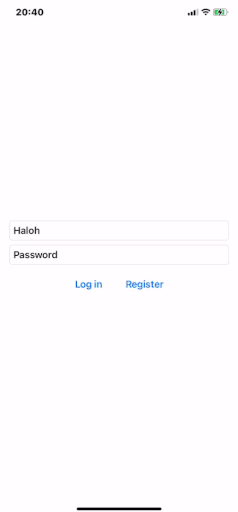
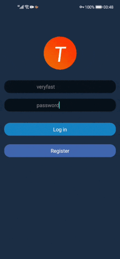

### Brief introduction

A simple example app, which implements login and registration.

### Backend

APIs (login / register) are provided by [tanserver](https://github.com/tansrv/tanserver), and the source file path is: `backend/user.py`.

### iOS

### Android

### Web
